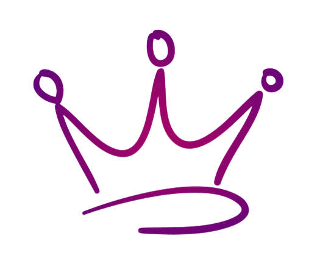

<!-- PROJECT LOGO -->
 

  

<h3 align="center">Brag Sheet</h3>

  

    A collection of achievements and adventures.
     
    <!--
    <a href="https://github.com/tarawithtiaras/engagements"><strong>Explore the docs »</strong></a>
     
     
    <a href="https://github.com/github_username/repo_name">View Demo</a>
    ·
    <a href="https://github.com/github_username/repo_name/issues">Report Bug</a>
    ·
    <a href="https://github.com/github_username/repo_name/issues">Request Feature</a>
    -->
  

<!-- TABLE OF CONTENTS -->

  
Table of Contents

  <ol>
    <li>
      <a href="#about-the-project">About The Project</a>
    <li><a href="#contact">Contact</a></li>
    <!--
    <li><a href="#acknowledgments">Acknowledgments</a></li> -->
  </ol>

<!-- ABOUT THE PROJECT -->
## About The Project
<!--
[![Product Name Screen Shot][product-screenshot]](https://example.com)
-->
I am attempting to keep track of everything that has happened over the last few years. A "brag sheet", if you will, about what I've accomplished for the year.

In theory, these will later be rounded up with videos and samples as a way of building a portfolio, but up until 2022, most everything had been behind an NDA or belonged to the company and not me.

If there is something you would like me to take part in or a topic you'd like to see me tackle - I'm open to ideas. Feel free to contact me by any of the methods below.

<!--
Here's a blank template to get started: To avoid retyping too much info. Do a search and replace with your text editor for the following: `github_username`, `repo_name`, `twitter_handle`, `linkedin_username`, `email_client`, `email`, `project_title`, `project_description`

(<a href="#readme-top">back to top</a>)

-->

<!-- CONTACT -->
## Contact

Tara Walton, aka TaraWithTiaras

[![LinkedIn][linkedin-shield]][linkedin-url]
[![Twitter][twitter-shield]][twitter-url]

(<a href="#readme-top">back to top</a>)

<!-- ACKNOWLEDGMENTS 
## Acknowledgments

* 
* 
* 

(<a href="#readme-top">back to top</a>)

-->

<!-- MARKDOWN LINKS & IMAGES -->
<!-- https://www.markdownguide.org/basic-syntax/#reference-style-links -->

[linkedin-shield]: https://img.shields.io/badge/LinkedIn--Blue?style=social&logo=LinkedIn&label=LinkedIn&link=https%3A%2F%2Fwww.linkedin.com%2Fin%2Ftarawalton%2F
[linkedin-url]: https://www.linkedin.com/in/tarawalton/

[twitter-shield]: https://img.shields.io/badge/Twitter--Grey?style=social&logo=X&label=Twitter&link=https%3A%2F%2Ftwitter.com%2FTaraWithTiaras
[twitter-url]: https://twitter.com/TaraWithTiaras

[product-screenshot]: images/screenshot.png
